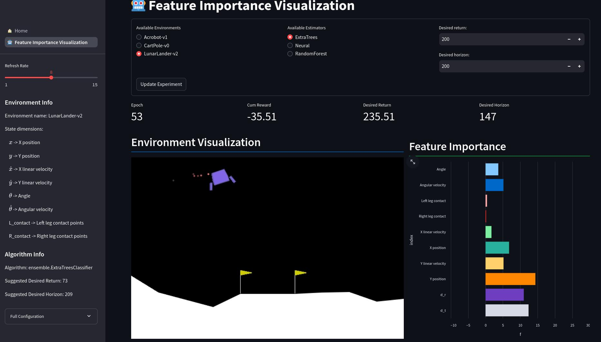

# Upside-Down RL




This project implements an Upside-Down Reinforcement Learning (UDRL) agent.

This is the codebase of the paper: [arXiv](https://arxiv.org/abs/2411.11457)

The website associated with it is: [demo](https://vimmoos-udrl.hf.space/)


### Installation

1. Make sure you have Python 3.10 installed. You can check your version with `python --version`.
   **NOTE**  Use a virtual env to avoid dependency clash
2. Install the project dependencies using Poetry:
   ```bash
   poetry install
   ```
   If you do not have poetry use pip to install the requirements like so:
   ```bash
   pip install -r requirements.txt
   ```


### Running the Experiment

You can run the experiment with various configuration options using the command line:

```bash
poetry run python -m udrl [options]
```
**Note** If you are already inside a virtual env `python -m udrl [options]` is enough
**Note** All defaults are for the CartPole-v0
Available options include:

* `--env_name`: Name of the Gym environment (default: `CartPole-v0`)
* `--estimator_name`: "neural" for NN or a fully qualified name of the scikit-learn estimator class (default: `ensemble.RandomForestClassifier`)
* `--seed`: Random seed (default: `42`)
* `--max_episode`: Maximum training episodes (default: `500`)
* `--collect_episode`: Episodes to collect between training (default: `15`)
* `--batch_size`: Batch size for training (default: `0`, uses entire replay buffer)
* Other options related to warm-up, memory size, exploration, testing, saving, etc.


### Result Data

* Experiment configuration and final test results are saved in a JSON file (`conf.json`) within a directory structure based on the environment, seed, and non-default configuration values (e.g., `data/[env-name]/[experiment_name]/[seed]/conf.json`).
* If `save_policy` is True, the trained policy is saved in the same directory (`policy`).
* If `save_learning_infos` is True, learning infos and rewards  during training are saved as a NumPy file (e.g.`test_rewards.npy`) and a json file (e.h.`learning_infos.json`) in the same directory.

### Process Data
* A base post processing is available to convert the results data in csvs run it as `python -m udrl.data_proc`

### Project Structure

* `data`: Stores experiment results and other data.
* `old_code`: Contains previous code versions (not used in the current setup).
* `poetry.lock`, `pyproject.toml`: Manage project dependencies and configuration.
* `README.md`: This file.
* `udrl`: Contains the main Python modules for the UDRL agent.

Please refer to the code and comments for further details on the implementation.


## Troubleshooting

If you encounter any errors during installation or execution, or if you have any questions about the project, feel free to reach out to me at [massimiliano@falzari.dev](mailto:massimiliano@falzari.dev) or open an issue. I'll be happy to assist you!
